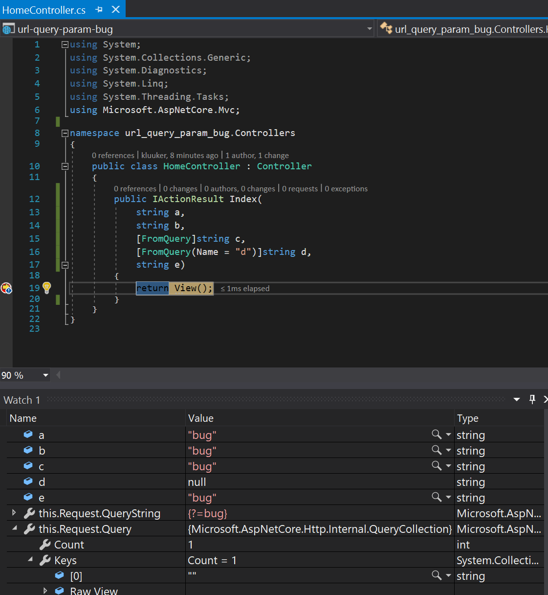
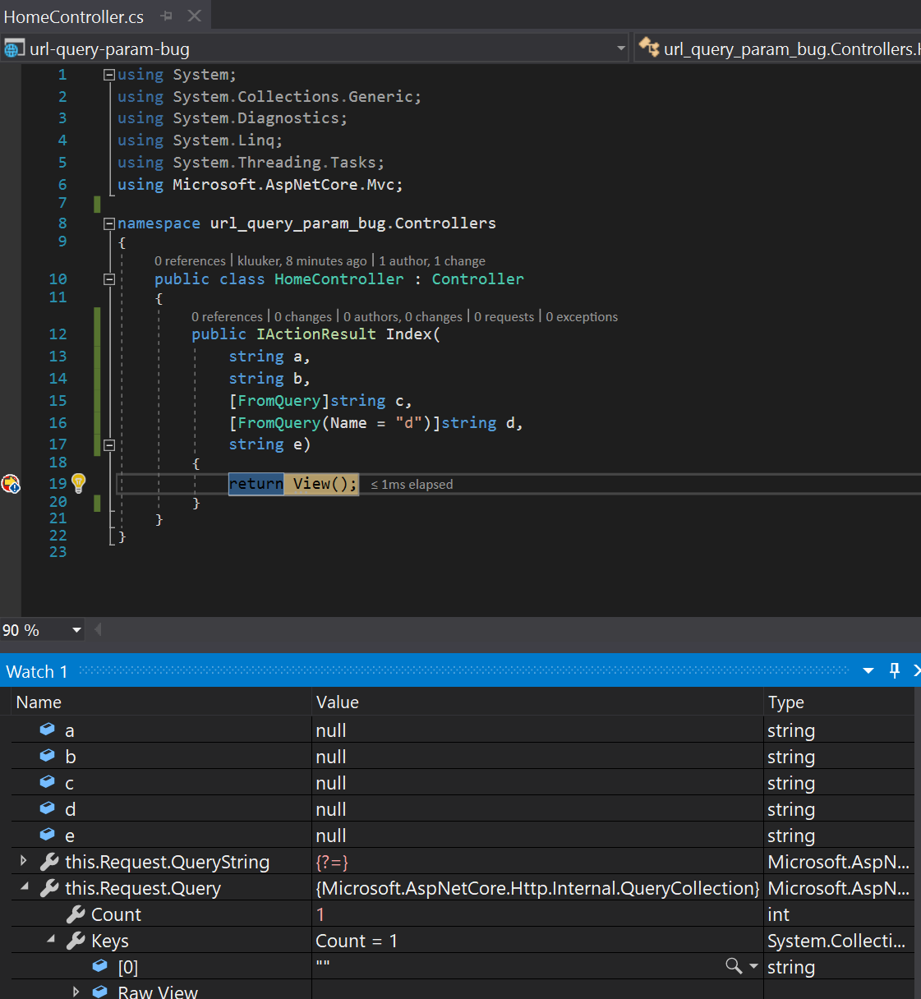
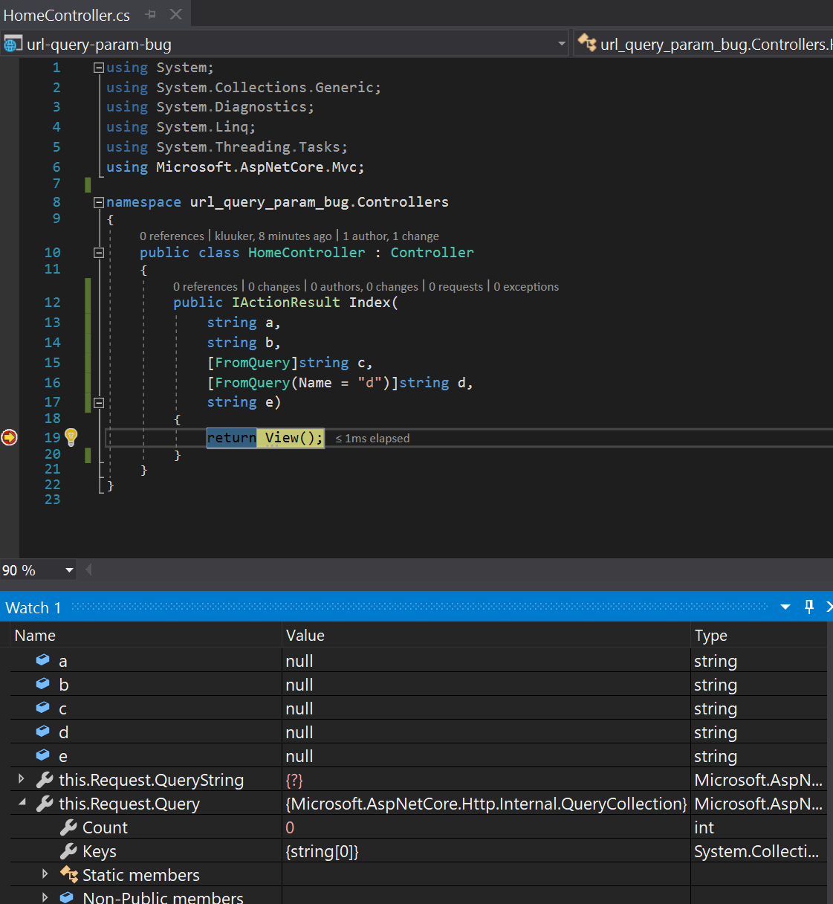

# bug-url-query-param

when sending the following url **?=bug** every parameter will get filled with the string "bug"
(except those with the `FromQuery` attribute that has the `Name=` property specified)

sending a empty pair like **?=** results in

sending just a **?** is normal

